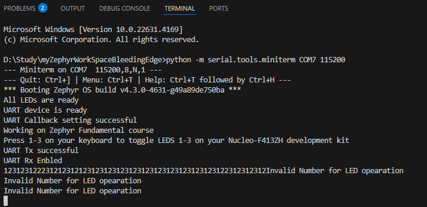

# appZ_UartDriverTrials
Contains a zephyr sample application to test sample UART driver.

## Explaining the structure
The currently used UART driver uses UART3 from NUCLEO-F413ZH.
The same UART that is configured as a debug and console UART.
Currenlty we are using the CONFIG_UART_INTERRUPT_DRIVEN kconfig which uses a simplified version on UART driver.
Alternatively, we may also use CONFIG_UART_ASYNC_API in kconfig, this uses DMA for UART data transmission and reception.
Using CONFIG_UART_ASYNC_API should be used when:
✅ High data rate (e.g. >500 kbps)
✅ Continuous RX streams
✅ Want DMA, minimal ISR load
✅ Comfortable with event-driven design

### Comparison (at a glance)

	Low	High
CPU load	Medium	Low
DMA
	Safe	❌
Shell / printk	Perfect	Overkill

| Feature   | IRQ API  | ASYNC API  |
|:---------:|:--------:|:----------:|
| Complexity | Low|High |
| DMA | ❌ | ✅ |
| Mixing APIs | Safe | Not Safe |
| Shell/ printk | Perfect | Overkill |

## Miniterm
Miniterm can be used as a python terminal as a serail monitor.
Instal miniterm using pip.
And to run miniterm, just run the following command:
```cmd
> python -m serial.tools.miniterm COM7 115200
```

This does assumes that your board is connected at COM port 7 and the baudrate configured for device is 115200bps.


## Results
After running the application, on the UART console using miniterm, the output for the console should look something like below:

